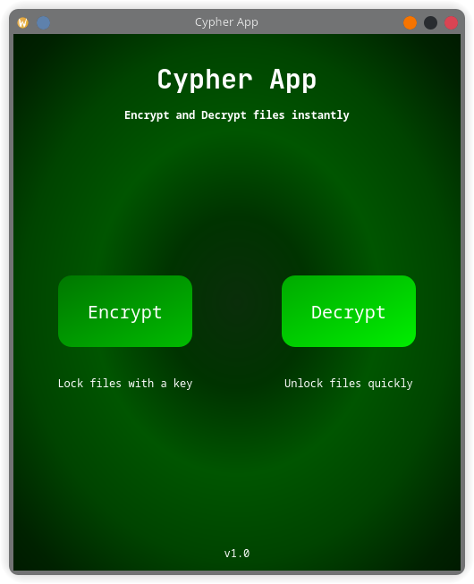
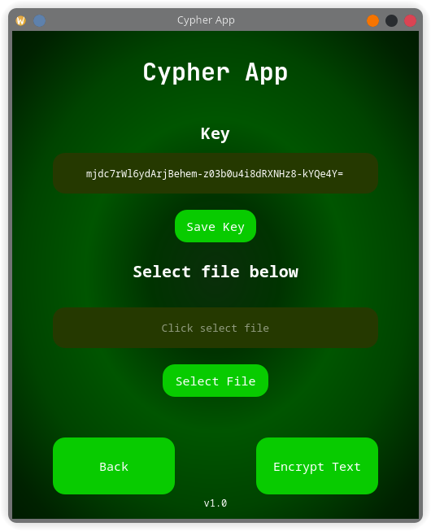
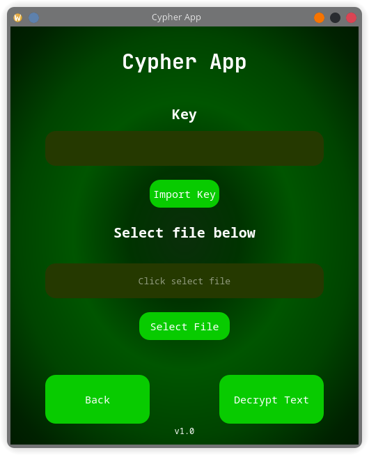

# Cypher App

**Cypher App** is a simple and intuitive Python application for encrypting and decrypting files using **Fernet symmetric encryption**. Built with **PyQt5**, it provides a clean graphical interface for securing your files with a key. The app also supports saving and importing encryption keys for later use.

---

## Features

- **Encrypt Files**: Secure your files with a generated Fernet key.
- **Decrypt Files**: Unlock encrypted files using the saved or imported key.
- **Key Management**: Save the encryption key to a file (`key.key`) or import an existing key.
- **File Selection GUI**: Easily select files to encrypt or decrypt.
- **Text Encryption Support**: Encrypt and decrypt file content directly from the GUI.
- **User-Friendly Design**: Attractive and clean interface built with PyQt5.

---

## Screenshots



*Main Menu: Choose Encrypt or Decrypt*



*Encrypt your files and save the key*



*Decrypt files using an imported key*

---

## Requirements

Make sure you have **Python 3.9+** installed.  

Python libraries required:

- [PyQt5](https://pypi.org/project/PyQt5/)  
- [cryptography](https://pypi.org/project/cryptography/)

You can install the dependencies using:

```bash
pip install -r requirements.txt
